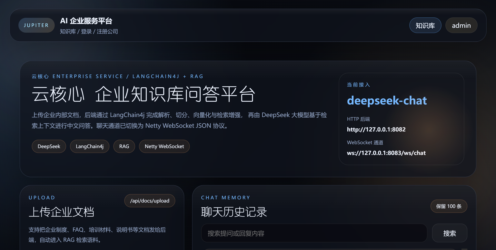
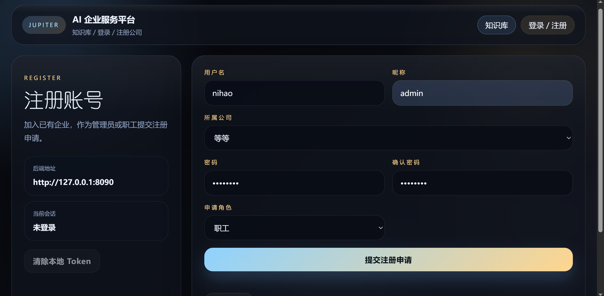
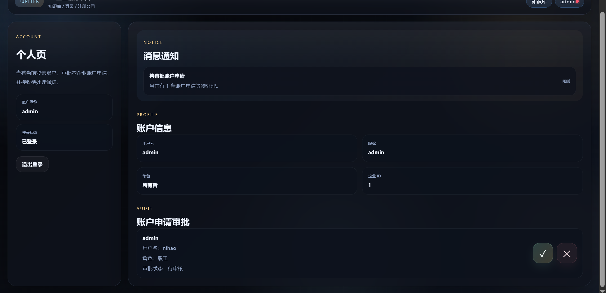
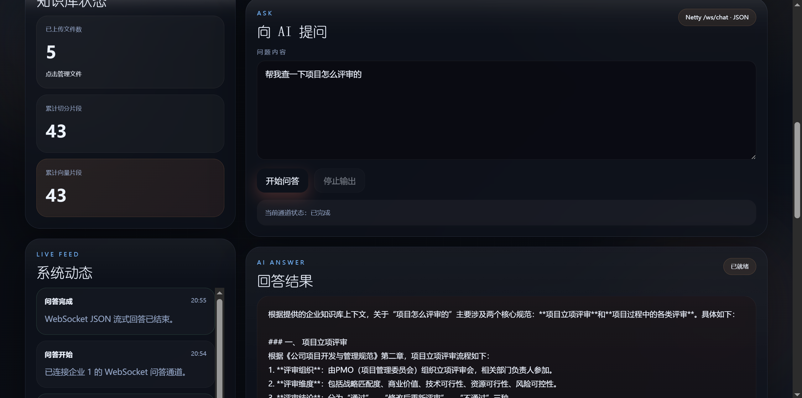
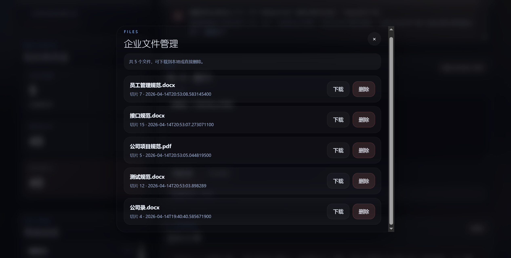
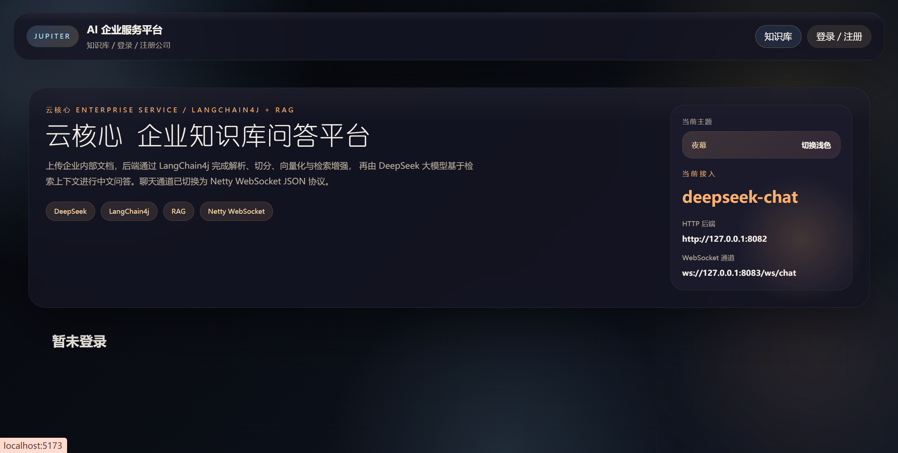
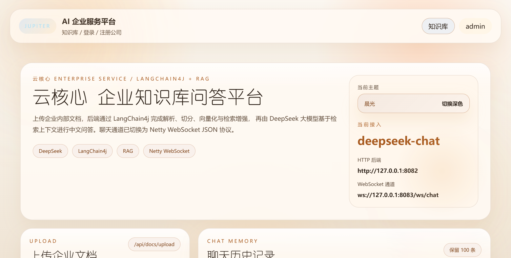
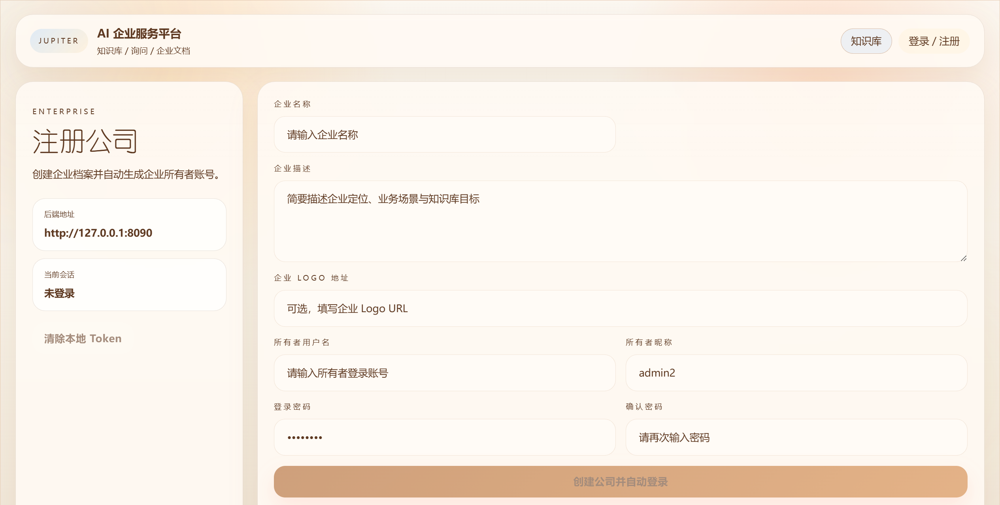

# AI 企业知识库平台
=======
# AI企业知识库
一个基于 `Vue 3 + Vite`、`Golang Gin` 和 `Spring Boot` 的企业服务平台示例项目。

项目将传统业务系统和 AI 知识库能力拆成两套后端，覆盖企业注册、账户审批、多文件上传、企业知识库、RAG 问答以及 WebSocket 流式响应等功能。

## Features

- `Golang / Spring Boot` 双后端拆分
- 企业注册与账户审批流程
- `所有者 / 管理员 / 职工` 角色体系
- 企业级知识库上传与管理
- 多文件上传
- 基于企业私有数据的 RAG 问答
- WebSocket 流式输出
- 前端浅色 / 深色模式展示

## Screenshots


### 首页 / 知识库



### 登录 / 注册



### 个人页



### 向AI提问



### 文件管理




### 未登录页



### 浅色模式



### 注册公司



## Tech Stack

### Frontend

- `Vue 3`
- `Vite`
- `Vue Router`
- `Axios`
- `XTerm`

### Backend

#### Business Service

- `Golang`
- `Gin`
- `GORM`
- `MySQL`
- `JWT`
- `Redis`

#### AI Service

- `Java 17`
- `Spring Boot 3`
- `LangChain4j`
- `Redis`
- `Netty`
- `Apache Tika`
- `OkHttp SSE`

### Model

- Chat Model: `DeepSeek`
- Embedding Model: `智谱 embedding-3`

## Project Structure

```text
AI企业服务/
├─ backend/              # Spring Boot AI 知识库后端
├─ ginbackend/           # Golang Gin 业务后端
├─ vuefront/             # Vue 3 前端
├─ images/               # README 截图资源
├─ NOTICE.md             # 项目阅读辅助说明
└─ README.md
```

## Modules

### `ginbackend/`

负责业务系统能力：

- 企业创建
- 企业列表查询
- 用户注册 / 登录
- 待审批账户查询
- 账户审批
- JWT 鉴权

### `backend/`

负责 AI 知识库能力：

- 文件上传
- 多文件处理
- 文档解析与切片
- 向量化与检索
- 文件统计 / 下载 / 删除
- HTTP 问答
- WebSocket 流式问答

### `vuefront/`

负责前端页面与交互：

- 登录 / 注册 / 注册企业
- 个人页与待审批通知
- 知识库上传与问答交互
- 浅色 / 深色模式展示

## Core Flow

### 1. 企业创建

1. 前端提交企业信息与所有者账户信息
2. Go 后端创建企业档案
3. 自动创建企业所有者账号
4. 返回 token，进入个人页

### 2. 用户注册与审批

1. 用户选择已有企业并提交注册
2. 系统创建待审核账户
3. 管理员或所有者查看待审批列表
4. 对申请进行通过或驳回
5. 审批通过后账号可登录

### 3. 知识库上传

1. 用户登录后上传一个或多个文件
2. Java 后端接收 `MultipartFile[]`
3. 解析文档并切片
4. 生成 Embedding
5. 写入企业向量存储并保存元数据

### 4. RAG 问答

1. 用户发起问题
2. 后端对问题向量化
3. 在当前企业知识库中检索相关片段
4. 拼接上下文构造 Prompt
5. 调用模型生成答案
6. 通过 HTTP 或 WebSocket 返回前端

## API Overview

### Business API

- `POST /api/v1/enterprises/apply`
- `GET /api/v1/enterprises/list`
- `POST /api/v1/users/register`
- `POST /api/v1/users/login`
- `GET /api/v1/users/audit/pending`
- `POST /api/v1/users/audit`

### AI API

- `POST /api/docs/upload`
- `GET /api/docs/files`
- `GET /api/docs/download`
- `DELETE /api/docs/file`
- `GET /api/docs/stats`
- `GET /api/chat?q=...`
- `ws://127.0.0.1:8083/ws/chat`

## Quick Start

### 1. Start Business Backend

```bash
cd ginbackend
go mod tidy
go run ./project
```

### 2. Start AI Backend

```bash
cd backend
mvn spring-boot:run
```

### 3. Start Frontend

```bash
cd vuefront
npm install
npm run dev
```

## Notes

- 知识库按企业维度隔离，上传与检索都依赖企业身份。
- 账户注册后并非默认可登录，需要经过审批流程。
- 截图文件目前保留原始命名，后续如需进一步整理，可统一改成英文语义化名称。
- 根目录 `NOTICE.md` 提供了更适合阅读源码的链路说明。

## License


This project is licensed under the Apache License 2.0.
See the [LICENSE](./LICENSE) file for details.

